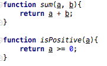
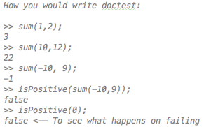

# JSTester

Two handy applications that can help testing your javascript code.

## Web application

Small webapplication that enables to generate a script for doctest-like testing for javascript

Usage:
* Go to the webapplication [link](http://users.ugent.be/~madbuck/JSTester/webapplication/)
* Paste the doctest code
* Click GO
* Optionally: click MINIFY (get it all on 1 line, much cleaner.)
* Paste code in js script
* Run and see

Example functions:

Example doctest:

Example JSTest outcome:

Example after running:

### Contributor
* [Manu De Buck](https://github.com/ManuDeBuck)

## Javascript script

Javascript script to test doctests (considering errors, classes, code flow)

Usage:

Your code should look like this:
* The code itself
* The doctests, in the format as shown below (the quotes are important)
* The doctest.txt script 

Example code:

Example output:

### Contributor
* [Robin De Baets](https://github.com/RobinDeBaets)
